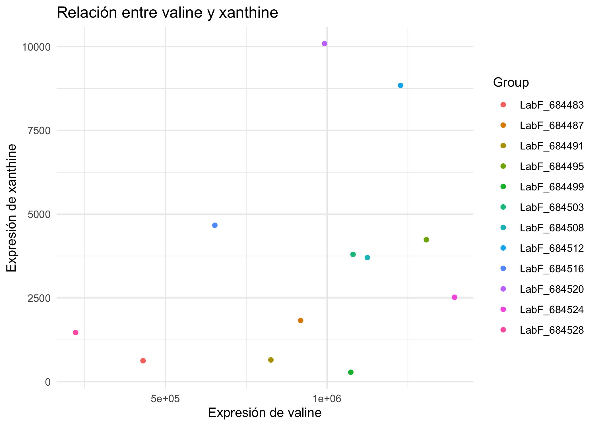
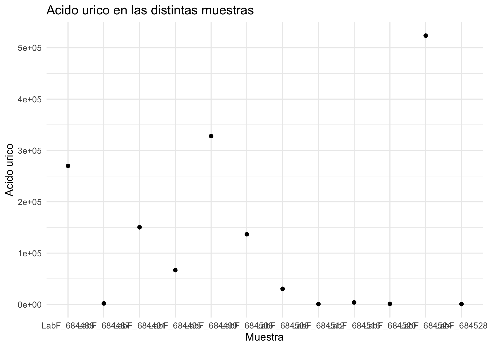

# Análisis de datos ómicos - PEC 1

Autor: **Juan Luis Hernández García**

## Informes

* [**Informe RMarkdown**](https://juanluishg.github.io/Hernandez-Garcia-Juan-Luis-PEC1/load_explore_save.html)
* [**Informe PEC1**](https://juanluishg.github.io/Hernandez-Garcia-Juan-Luis-PEC1/PEC1-Informe.pdf)
* [**Metadatos**](https://juanluishg.github.io/Hernandez-Garcia-Juan-Luis-PEC1/dataset_metadata.md)
* [**Readme**](https://juanluishg.github.io/Hernandez-Garcia-Juan-Luis-PEC1)

## Graficos

## Estructura

* **2023-UGrX-4MetaboAnalystTutorial**: Carpeta que contiene el dataset de [Metabolomic Workbench](https://github.com/nutrimetabolomics/metaboData?tab=readme-ov-file)
* **load_explore_save.Rmd**: Script de R (en RMarkdown) donde se carga el dataset en formato SummarizedExperiment, se realiza una exploración de los datos y finalmente se exporta como .Rda
* **load_explore_save.hmtl**: Render el RMarkdown proporcionado por R.
* **intestinal_samples_pre_post_transplantation.Rda**: Fichero de datos de R, que contiene el objeto SummarizedExperiment
* **intestinal_samples_pre_post_transplantation_metadata.Rda**: Fichero de datos de R, que contiene los metadatos del experimento
* **metaboliteData.txt**: Exportación de los datos en formato texto
* **dataset_metadata.md**: Markdown con los metadatos
* **PEC1-Informe**: Informe en PDF del trabajo realizado

## Referencias

* [The SummarizedExperiment class](https://carpentries-incubator.github.io/bioc-project/09-summarizedexperiment.html)
* [metaboData](https://github.com/nutrimetabolomics/metaboData/tree/main)